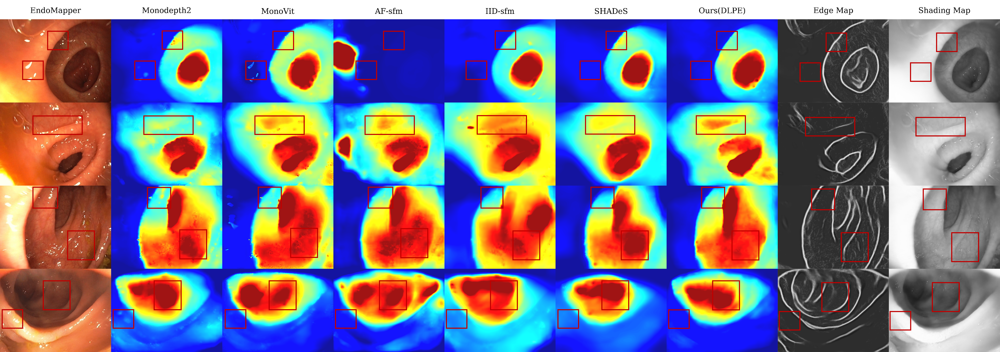

# PRISM

Official code for **"Multi-Modal Monocular Endoscopic Depth and Pose Estimation with Edge-Guided Self-Supervision"**.

PRISM trains monocular endoscopic depth and pose networks with RGB frames plus optional edge and shading/luminance cues.




## Repository Layout

- `train.py`, `trainer.py`: joint depth/pose training.
- `train_depth.py`, `trainer_depth.py`: depth-focused training.
- `train_edge.py`, `trainer_edge.py`: edge-guided training.
- `train_edge_pose_from_scratch.py`: edge-guided training with pose initialized from a generic checkpoint.
- `train_edge_pose_from_mod.py`: edge-guided training from an existing PRISM checkpoint.
- `depth_evaluate_max_norm.py`: C3VD/Hamlyn-style depth prediction and evaluation.
- `depth_evaluate_endomapper.py`, `depth_evaluate_endomapper_288.py`: EndoMapper-style depth prediction scripts.
- `pose_predict_feast_v1.py`: pose prediction export.
- `datasets/`: KITTI-compatible loaders and the endoscopy loader.
- `networks/`: PRISM/Monodepth2-style models with optional RGB+edge/shading input channels.
- `networksIID/`, `networksMonoDepth2/`, `networksMonoVIT/`: ablation and baseline model variants.
- `splits/`: train/validation/test file lists.

## Setup

Create an environment with PyTorch, then install dependencies:

```bash
pip install -r requirements.txt
```

MonoViT paths require `mmcv`, `mmengine`, `mmsegmentation`, `timm`, and `einops`. The Monodepth2-style PRISM path mainly uses PyTorch, torchvision, numpy, Pillow, scikit-image, scikit-learn, scipy, matplotlib, IPython, and tensorboardX.

## Paths

The code defaults to generic local folders:

```text
data_folder/
  input_data/
  generated/
weights/
output_data/
```

You can either use those folders or set environment variables:

```bash
export PRISM_DATA_ROOT=/path/to/data_folder
export PRISM_WEIGHTS_ROOT=/path/to/weights
export PRISM_OUTPUT_ROOT=/path/to/output_data
```

More specific overrides are also supported:

```bash
export PRISM_DATA_PATH=/path/to/input_data
export PRISM_GENERATED_PATH=/path/to/generated
export PRISM_WEIGHTS_PATH=/path/to/weights
export PRISM_OUTPUT_PATH=/path/to/output_data
```

## Data Preparation

Use this structure for C3VD-style data:

```text
data_folder/
  input_data/
    c3vd/
      sequence_name/
        0000_color.png
        0000_depth.tiff
        0001_color.png
        ...
  generated/
    c3vd/
      edge/
        sequence_name/
          avg/
            0000_color.png.npy
      shading/
        sequence_name/
          decomposed/
            light0000_color.png
```

Use this structure for Hyper-Kvasir/Hamlyn-style data:

```text
data_folder/
  input_data/
    hk/
      sequence_name/
        00001.jpg
        00002.jpg
        ...
  generated/
    hk/
      edge/
        sequence_name/
          avg/
            00001.png.npy
      shading/
        sequence_name/
          decomposed/
            light00001.png
```

The split files can contain absolute paths or paths matching your mounted data. For a portable release, prefer paths under `data_folder/input_data/...`.

## Generate Edge And Shading Inputs

PRISM expects edge maps as `.npy` files and shading/luminance maps as image files. Generate them before training any model whose name uses `edge`, `lum`, `dlpe`, or `depl`.

Example edge output for C3VD:

```text
data_folder/generated/c3vd/edge/sequence_name/avg/0000_color.png.npy
```

Example shading output for C3VD:

```text
data_folder/generated/c3vd/shading/sequence_name/decomposed/light0000_color.png
```

The paper experiments used FEAST-style edge outputs and intrinsic-image-decomposition shading outputs. If you use a different edge or shading method, keep the same filenames and folder layout or pass explicit roots to the prediction scripts with `--edge_root` and `--shading_root`.

## Training

Joint depth and pose training:

```bash
python train.py \
  --model_name prism_c3vd \
  --dataset hk \
  --data c3vd \
  --split c3vd_mysplit \
  --height 288 \
  --width 288 \
  --png \
  --training_mode both
```

Edge-guided training:

```bash
python train_edge.py \
  --model_name prism_c3vd_both_edge_ssim \
  --dataset hk \
  --data c3vd \
  --split c3vd_mysplit_interval10 \
  --height 288 \
  --width 288 \
  --png \
  --training_mode both \
  --edge_loss
```

Depth-only and pose-only ablations:

```bash
python train_depth.py --model_name prism_depth_edge_ssim --dataset hk --data c3vd --split c3vd_mysplit --png --training_mode depth
python train_edge_pose_from_scratch.py --model_name prism_pose_edge_ssim --dataset hk --data c3vd --split c3vd_mysplit --png --training_mode pose
```

You can also store options in JSON:

```bash
python train.py --config configs/prism_c3vd.json
```

## Evaluation And Prediction

C3VD/Hamlyn-style depth prediction/evaluation:

```bash
python depth_evaluate_max_norm.py \
  --image_path data_folder/input_data/c3vd \
  --model_basepath weights \
  --model_name prism_c3vd/models/weights_19 \
  --output_path output_data/depth \
  --eval \
  --edge_root data_folder/generated/c3vd/edge \
  --shading_root data_folder/generated/c3vd/shading
```

EndoMapper-style depth prediction uses:

```text
data_folder/input_data/endomapper
data_folder/generated/endomapper/edge
data_folder/generated/endomapper/shading
```

Then run:

```bash
python depth_evaluate_endomapper.py
```

Pose prediction export:

```bash
python pose_predict_feast_v1.py \
  --model_name prism_c3vd_both_edge_ssim \
  --weights_base weights \
  --output_base output_data/pose \
  --data_path data_folder/input_data/c3vd \
  --edge_root data_folder/generated/c3vd/edge \
  --shading_root data_folder/generated/c3vd/shading
```

## Notes

- Model names containing `depth_edge`, `pose_edge`, `both_edge`, `depth_lum`, `pose_lum`, `both_lum`, `dlpe`, or `depl` control whether the code loads extra edge/shading channels.
- `splits/` are kept because they are needed for training and evaluation. One-off split-generation scripts and notebook scratch files are not required for normal use.
- Generated Python bytecode and cached files are intentionally excluded.
