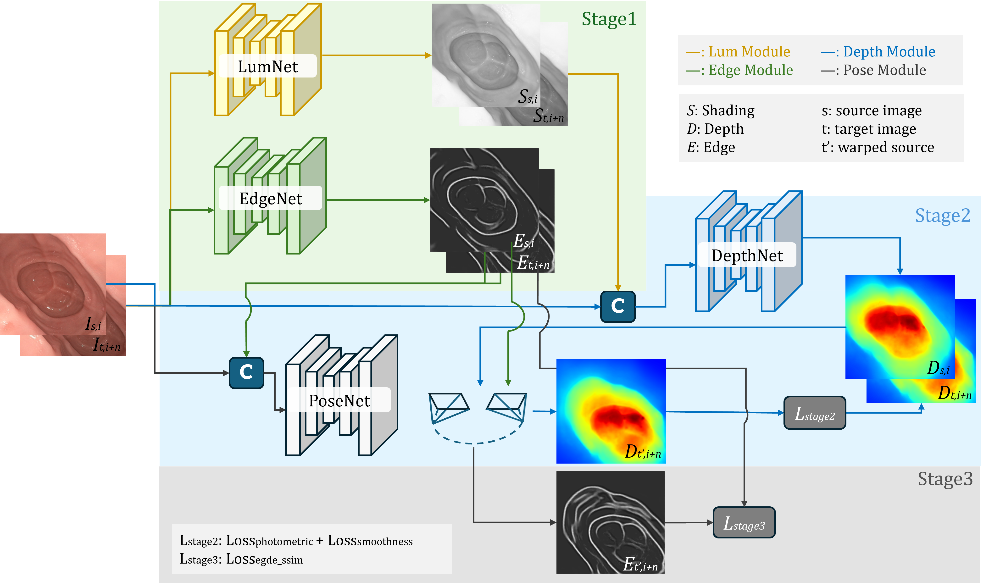

# PRISM

<sub><strong>P</strong>ose <strong>R</strong>efinement with <strong>I</strong>ntrinsic <strong>S</strong>hading and edge <strong>M</strong>aps</sub>

[](https://github.com/XinweiJu/PRISM/releases/tag/v1.0.0)
[](https://xinweiju.github.io/PRISM/)


**[Paper](https://doi.org/10.1007/s11548-026-03669-1) ·
[Project page](https://xinweiju.github.io/PRISM/) ·
[Download weights](https://github.com/XinweiJu/PRISM/releases/tag/v1.0.0)**

Code for **[Multi-Modal Monocular Endoscopic Depth and Pose Estimation with Edge-Guided Self-Supervision](https://doi.org/10.1007/s11548-026-03669-1)**.

The canonical DLPE configuration uses RGB + shading/luminance for the depth
branch and RGB + edge for the pose branch. This repository contains the
depth/pose training code, reproducible preprocessing entrypoint, example
configurations, data contract, and reference inference code.



## 🛠️ Installation

The original PRISM environment used Ubuntu 20.04, Python 3.8.10, PyTorch
1.10.0, and CUDA 10.2. Install the torchvision build compatible with the
selected PyTorch build. These versions document the tested environment; newer
compatible PyTorch/CUDA installations may also work.

Clone the repository, create a Python environment with a CUDA-compatible
PyTorch build, and install the dependencies:

```bash
git clone https://github.com/XinweiJu/PRISM.git
cd PRISM
python -m venv .venv
source .venv/bin/activate
pip install -r requirements.txt
```

The default PRISM path needs PyTorch, torchvision, NumPy, Pillow, OpenCV, SciPy, scikit-image, scikit-learn and tensorboardX. To reproduce the MonoViT ablation and install its additional packages, use:

```bash
pip install -r ablations/requirements.txt
```

Datasets, generated modalities and checkpoints are deliberately not committed.
Configure their roots with:

```bash
export PRISM_DATA_ROOT=/path/to/data_folder
export PRISM_WEIGHTS_ROOT=/path/to/weights
export PRISM_OUTPUT_ROOT=/path/to/output_data
```

The more specific variables `PRISM_DATA_PATH`, `PRISM_GENERATED_PATH`, `PRISM_WEIGHTS_PATH`, and `PRISM_OUTPUT_PATH` override individual locations.

## 🚀 Quick start

1. Arrange the RGB data using the filename contract in
   [`docs/DATA_PREPARATION.md`](docs/DATA_PREPARATION.md).
2. Download `PRISM-DLPE-weights-v1.0.0.tar.gz` and its `.sha256` file from the
   [v1.0.0 Release](https://github.com/XinweiJu/PRISM/releases/tag/v1.0.0), then unpack it:

```bash
wget https://github.com/XinweiJu/PRISM/releases/download/v1.0.0/PRISM-DLPE-weights-v1.0.0.tar.gz
wget https://github.com/XinweiJu/PRISM/releases/download/v1.0.0/PRISM-DLPE-weights-v1.0.0.tar.gz.sha256
sha256sum -c PRISM-DLPE-weights-v1.0.0.tar.gz.sha256
mkdir -p weights
tar -xzf PRISM-DLPE-weights-v1.0.0.tar.gz -C weights
```

   The archive contains `dlpe`, `lum_generator`, and `edge_generator`; no
   checkpoint renaming is required.
3. Generate edge and luminance inputs by following
   [Prepare modalities](#1-prepare-modalities).

4. Train the DLPE configuration:

```bash
python train_prism.py --pipeline joint \
  --config configs/prism_dlpe_hk.json
```

Paths and machine-specific settings can be overridden after `--config`; for
example, `--data_path /data/hk --batch_size 32 --num_workers 8`. Command-line
arguments take precedence over JSON values.

## 📐 Data preprocessing contract

The complete specification is in
[`docs/DATA_PREPARATION.md`](docs/DATA_PREPARATION.md). The important numeric
conventions are:

| Input | Stored form | Tensor seen by the PRISM loader |
| --- | --- | --- |
| RGB | RGB JPEG/PNG | `float32 [0,1]`; encoder applies `(x-0.45)/0.225` |
| Edge | `float32 .npy` | one channel in `[0,1]` |
| Luminance | grayscale PNG | one channel in `[0,255]`, intentionally not divided by 255 |

The preprocessing command reproduces the generator path used in the original
PRISM experiments: IID/SHADES sigmoid illumination is multiplied by 255;
DexiNed's seven sigmoid side outputs are independently min-max normalized,
resized, averaged, and divided by 255. It also writes a manifest containing
the checkpoint SHA256 hashes.

## 🏋️ Training

PRISM uses the following three-stage workflow:

1. Pre-generate shading/luminance and edge maps with
   `preprocessing/generate_modalities.py`.
2. Jointly train depth and pose with `trainer.py`.
3. Load the joint checkpoint, freeze the depth encoder/decoder, and fine-tune pose with the specialist trainer in `ablations/training/`.

### 1. Prepare modalities

The generator needs the released `lum_generator` and `edge_generator` weights.
The luminance architecture is included in this repository. DexiNed's model
definition is loaded from a local clone of the
[DexiNed repository](https://github.com/xavysp/DexiNed); its released PRISM
checkpoint was trained on SegCol rather than the original DexiNed dataset.

Clone DexiNed next to PRISM (or use any existing checkout):

```bash
git clone https://github.com/xavysp/DexiNed.git external/DexiNed
```

Generate both modalities for every Hyper-Kvasir RGB frame:

```bash
python preprocessing/generate_modalities.py \
  --dataset hk \
  --input-root data_folder/input_data/hk \
  --output-root data_folder/generated \
  --iid-checkpoint-dir weights/PRISM-DLPE-weights-v1.0.0/lum_generator \
  --dexined-repo external/DexiNed \
  --dexined-checkpoint weights/PRISM-DLPE-weights-v1.0.0/edge_generator/16_model.pth \
  --device cuda
```

For C3VD, use the same command with the dataset and RGB root changed:

```bash
python preprocessing/generate_modalities.py \
  --dataset c3vd \
  --input-root data_folder/input_data/c3vd \
  --output-root data_folder/generated \
  --iid-checkpoint-dir weights/PRISM-DLPE-weights-v1.0.0/lum_generator \
  --dexined-repo external/DexiNed \
  --dexined-checkpoint weights/PRISM-DLPE-weights-v1.0.0/edge_generator/16_model.pth \
  --device cuda
```

Before processing a complete dataset, test one image with `--limit 1`. Use
`--device cpu` on a machine without CUDA and `--overwrite` only when existing
outputs should be regenerated. Successful execution writes both modalities and
`generated/<dataset>/generation_manifest.json`, which records the input/output
roots, processed image counts, network sizes, and checkpoint SHA256 hashes.

For an RGB image such as `sequence/00001.jpg`, the loaders expect generated modalities under the configured generated-data root. Representative layouts are:

```text
generated/
├── hk/
│   ├── edge/sequence/avg/00001.png.npy
│   └── shading/sequence/decomposed/light00001.png
└── c3vd/
    ├── edge/sequence/avg/0000_color.png.npy
    └── shading/sequence/decomposed/light0000_color.png
```

Exact path derivation, ranges, interpolation, temporal-neighbor requirements,
and naming rules are documented in
[`docs/DATA_PREPARATION.md`](docs/DATA_PREPARATION.md). Check the selected split
before launching a new dataset because naming conventions differ between HK
and C3VD exports.

Dataset roots, complete sequence lists, split overlap notes, and frame counts
are documented in [`docs/DATASETS.md`](docs/DATASETS.md) and mirrored in
[`configs/datasets.json`](configs/datasets.json). Split entries use portable
`<sequence>/<filename>` paths resolved relative to `--data_path`.

### 2. Joint depth/pose training

```bash
python train_prism.py --pipeline joint \
  --model_name hk_mono_finetuned_dlpe_edge_ssim \
  --dataset hk --data hk --split hk \
  --height 288 --width 288 \
  --training_mode both --edge_loss
```

The modality convention encoded by the trainers is:

| Model-name token | Depth input | Pose input |
| --- | --- | --- |
| `dlpe` | RGB + luminance | RGB + edge |
| `depl` | RGB + edge | RGB + luminance |
| `both_edge` | RGB + edge | RGB + edge |
| `both_lum` | RGB + luminance | RGB + luminance |
| `depth_edge` / `depth_lum` | selected extra depth channel | RGB |
| `pose_edge` / `pose_lum` | RGB | selected extra pose channel |

These strings are functional configuration, not merely experiment labels; do not rename a checkpoint without preserving the corresponding modality choice.

### 3. Freeze depth and fine-tune pose

Use `edge_pose_resume` to load the joint checkpoint and invoke the frozen-depth pose trainer:

```bash
python train_prism.py --pipeline edge_pose_resume \
  --model_name hk_mono_finetuned_dlpe_edge_ssim_depth_fix_thorough_aug \
  --dataset hk --data hk --split hk \
  --height 288 --width 288 \
  --training_mode pose --edge_loss
```

`edge_pose_scratch` initializes the pose branch from the generic Monodepth2 pose checkpoint instead. The legacy `depth` and `edge` pipeline aliases remain available for reproducing older experiments, but both specialist trainers freeze depth and optimize pose; they are not depth-only trainers despite the historical filename `trainer_depth.py`.

Options may also be stored in JSON and passed with `--config path/to/config.json`. Command-line values override the corresponding defaults according to `options.py`.

The repository includes `configs/prism_dlpe_hk.json` and
`configs/prism_dlpe_c3vd.json`. These record the paper-style `288x288`,
three-frame, four-scale, 30-epoch setup; edit paths and batch size for the local
machine rather than encoding machine-specific absolute paths in a committed
config.

## 📦 Weights and GitHub Releases

Download the published
[`PRISM-DLPE-weights-v1.0.0.tar.gz`](https://github.com/XinweiJu/PRISM/releases/download/v1.0.0/PRISM-DLPE-weights-v1.0.0.tar.gz)
archive from GitHub Releases. Its SHA256 is:

```text
6bf41d7aef7d85e75e304732a63516b6434b0acf22e4fd0dd5898701f1b1f32a
```

The small accompanying
[`PRISM-DLPE-weights-v1.0.0.tar.gz.sha256`](https://github.com/XinweiJu/PRISM/releases/download/v1.0.0/PRISM-DLPE-weights-v1.0.0.tar.gz.sha256)
file contains that checksum for use with `sha256sum -c`; it is not another
checkpoint archive. After extraction, the weights have this layout:

```text
PRISM-DLPE-weights-vX.Y.Z/
├── checkpoints.json
├── dlpe/
│   ├── encoder.pth
│   ├── depth.pth
│   ├── pose_encoder.pth
│   └── pose.pth
├── lum_generator/
│   ├── decompose_encoder.pth
│   └── decompose.pth
└── edge_generator/
    └── 16_model.pth
```

The Release contains only the original four-channel DLPE model and its two
frozen preprocessing models—no optimizer state or unrelated experiment
weights. Provenance is:

- **DLPE:** RGB+luminance DepthNet and RGB+edge PoseNet trained on the committed
  Hyper-Kvasir split; the released final checkpoint follows edge-guided pose
  refinement with DepthNet frozen.
- **Lum generator (IID/LumNet):** `finetuned_mono_hkfull_288_pseudo_dsms_automasking_noadjust`,
  trained on Hyper-Kvasir at `288x288`; only the decomposition encoder and
  decoder required to generate luminance are included.
- **Edge generator (DexiNed/EdgeNet):** DexiNed trained on the SegCol colon-fold annotations;
  only `16_model.pth`, used to generate the averaged edge maps, is included.

Each Release includes an archive-level `.sha256` file. `checkpoints.json`
records every file hash, epoch, input routing, image size, dataset/split, and
preprocessing provenance. The expected local layout is also listed in the data
preparation guide.

## 🔍 Inference and evaluation

`predict_prism.py` is the supported dispatcher. The implementation modules live under `reference/` so they are separated from training code.

Depth inference/evaluation for C3VD-style folders:

```bash
python predict_prism.py depth-c3vd \
  --image_path /path/to/c3vd \
  --model_basepath weights/PRISM-DLPE-weights-v1.0.0 \
  --model_name dlpe \
  --output_path /path/to/output \
  --edge_root /path/to/generated/edge \
  --shading_root /path/to/generated/shading \
  --eval
```

Other maintained dispatch commands are:

```bash
python predict_prism.py depth-endomapper [arguments...]
python predict_prism.py depth-endomapper-288 [arguments...]
python predict_prism.py pose-c3vd [arguments...]
```

Run `python predict_prism.py COMMAND --help` to see the arguments implemented by a reference module. Checkpoints are expected to contain the usual `encoder.pth`, `depth.pth`, `pose_encoder.pth`, and `pose.pth` files as required by the selected command.

## Ablations

`ablations/` is intentionally importable but is not the default code path:

- `ablations/networks/iid`: historical IID-compatible encoder/decoders used by reference comparisons.
- `ablations/networks/monodepth2`: archived plain Monodepth2 baseline.
- `ablations/networks/monovit`: optional MonoViT backbone.
- `ablations/training`: frozen-depth pose fine-tuning implementations used by stage 3 and older edge-loss experiments.
- `ablations/splits`: historical interval-sampling split variants, excluded
  from the canonical PRISM configuration.

## Reproducibility notes

- Image height and width must be multiples of 32.
- A checkpoint's behavior depends on both its tensors and the model-name modality token.
- Preserve the exact preprocessing checkpoint and generated edge/shading files used for an experiment; the generator manifest records their hashes.
- Split files contain portable paths relative to `--data_path`.
- Outputs, weights, datasets, caches and logs are ignored by Git.


## 🗂️ Repository layout

```text
PRISM/
├── train_prism.py / trainer.py     # training entrypoint and trainer
├── predict_prism.py / reference/   # inference and evaluation
├── preprocessing/                  # luminance and edge generation
├── datasets/ / networks/           # loaders and PRISM models
├── configs/ / splits/              # canonical HK and C3VD experiments
├── docs/                            # specifications and project website
├── release/                         # checkpoint hashes and provenance
└── ablations/                       # optional baselines and archived splits
```

Shared root modules (`options.py`, `path_config.py`, `layers.py`, and
`utils.py`) provide configuration, paths, geometry/loss layers, and utilities.

## Citation and related resources

If you use this code or the released weights, please cite PRISM:

```bibtex
@article{ju2026prism,
  title   = {Multi-modal monocular endoscopic depth and pose estimation with edge-guided self-supervision},
  author  = {Ju, Xinwei and Daher, Rema and Stoyanov, Danail and Bano, Sophia and Vasconcelos, Francisco},
  journal = {International Journal of Computer Assisted Radiology and Surgery},
  year    = {2026},
  doi     = {10.1007/s11548-026-03669-1}
}
```

Please also cite the resources used by the corresponding experiment or
preprocessing stage:

- [PRISM paper](https://doi.org/10.1007/s11548-026-03669-1)
- [Hyper-Kvasir dataset](https://doi.org/10.1038/s41597-020-00622-y)
- [C3VD dataset](https://doi.org/10.1016/j.media.2023.102956)
- [EndoMapper dataset](https://doi.org/10.1038/s41597-023-02564-7)
- [SegCol fold-edge dataset](https://arxiv.org/abs/2412.16078)
- [DexiNed](https://doi.org/10.1109/WACV45572.2020.9093290)
- [IID-SfMLearner](https://doi.org/10.1109/JBHI.2024.3400804)
- [SHADeS](https://arxiv.org/abs/2502.12994)
- [Monodepth2](https://openaccess.thecvf.com/content_ICCV_2019/html/Godard_Digging_Into_Self-Supervised_Monocular_Depth_Estimation_ICCV_2019_paper.html)
